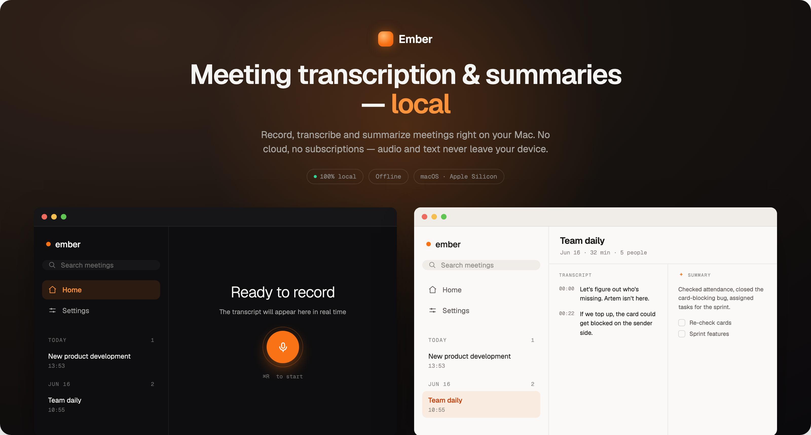
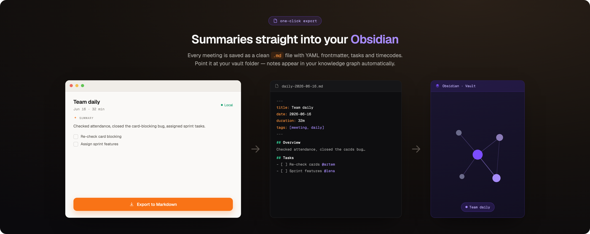

<div align="center">

<b>English</b> · <a href="README.ru.md">Русский</a> · <a href="README.zh.md">简体中文</a>


# Ember

**Local meeting recorder, transcriber and summarizer for macOS.**

Records your microphone and the other side of a call, writes a live transcript,
and produces a short summary — entirely on your Mac. Nothing is uploaded.




</div>

---

## What it does

Ember records a meeting (microphone + system audio), transcribes it on-device with
Whisper, and generates a structured summary — overview, decisions, action items — with a
local language model. It works offline; there is no account and no cloud.

## Features

- **Live transcript** while recording, with per-source tags: `[mic]` (you) and `[mac]` (the other side).
- **Automatic call detection** — recording starts when a call begins and stops when it ends, also while the window is in the background.
- **Local summaries** via Apple MLX (Qwen3), in the language of the transcript.
- **Search** across all meetings, rename, and Markdown / Obsidian export.
- **Menu-bar control** and **⌘R** to start/stop.
- Light / dark / auto theme; English, Russian and Chinese.
- Built-in updates from GitHub Releases.

## Export to Obsidian

Each summary can be written to a Markdown file (YAML front-matter, tasks, timestamps) in a
folder you pick — for example, an Obsidian vault.

<div align="center"></div>

## Install

Requires **macOS 14.4+** on **Apple Silicon**.

1. Download `Ember_1.4.1_aarch64.dmg` from the [Releases](../../releases/latest) page.
2. Drag **Ember.app** into **Applications**.
3. The app is ad-hoc signed (not notarized), so the first launch is blocked. Either
   right-click **Ember.app → Open → Open**, or run:
   ```bash
   xattr -dr com.apple.quarantine /Applications/Ember.app
   ```
4. On first run, choose the languages, then download a Whisper model and a summary model.

## Build from source

Requires a recent Xcode and [Tuist](https://tuist.dev).

```bash
cd native
tuist install
tuist generate
open Ember.xcworkspace          # or: xcodebuild -scheme Ember -configuration Release build
```

Models are fetched from Hugging Face on first run. Signing is ad-hoc only — no Apple
Developer account is needed.

## Privacy

- Recording, transcription and summarization run locally.
- Audio is written to a temporary folder and deleted right after transcription; only the
  text (transcript + summary) is kept, in a local SQLite database on your Mac.
- The only network access is downloading the models (Hugging Face) and checking for updates
  (GitHub). No telemetry, no accounts.

## Built with

SwiftUI · WhisperKit (CoreML/ANE) · Apple MLX (Qwen3) · GRDB (SQLite) · CoreAudio.
