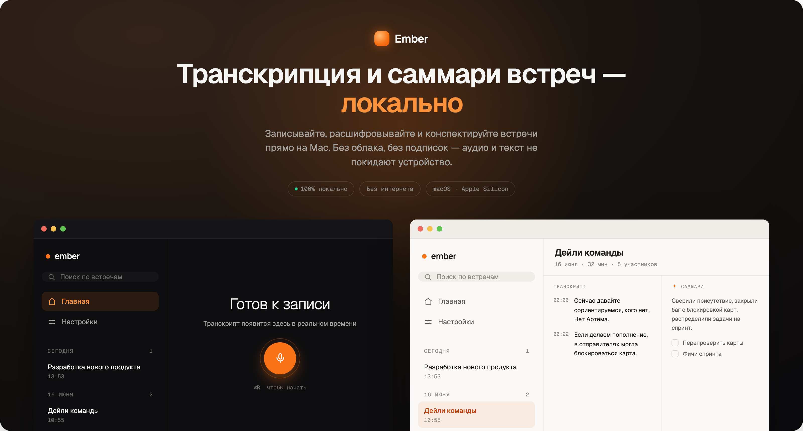
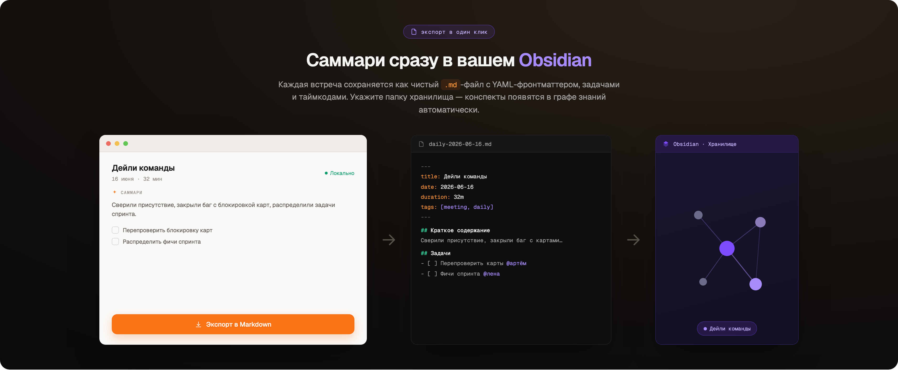

<div align="center">

<a href="README.md">English</a> · <b>Русский</b> · <a href="README.zh.md">简体中文</a>


# Ember

**Запись, транскрипция и саммари встреч — полностью локально.**

Записывайте, расшифровывайте и конспектируйте встречи прямо на Mac.
Без облака, без подписок — аудио и текст не покидают устройство.




</div>

---

## Что это

**Ember** — десктопное приложение для Mac, которое во время встречи захватывает звук
с микрофона и из системы, в реальном времени превращает его в транскрипт, а затем
готовит структурированное саммари (краткое содержание, решения, задачи).

Всё происходит **на устройстве**: распознавание речи — локальным Whisper, конспекты —
локальной ИИ-моделью. Ничего не отправляется в облако.

---

## Возможности

- **🎙️ Запись и живой транскрипт.** Микрофон и системный звук сводятся профессиональным
  микшером (RMS-дакинг, защита от клиппинга), речь распознаётся локально и появляется на
  экране в реальном времени — с живым эквалайзером и таймером.
- **🏠 Старт в один клик.** Кнопка записи или хоткей **⌘R**.
- **📞 Авто-детект звонков.** Ember следит за тем, какие приложения используют микрофон
  (Zoom, Google Meet, Teams, FaceTime, Telegram и т.п.): **начался созвон — запись
  стартует сама, звонок завершился — запись автоматически останавливается** и уходит в
  обработку. Работает в фоне, даже когда окно Ember свёрнуто, — ни одна встреча не
  пропадёт.
- **✦ Саммари в один клик.** Готовая встреча превращается в конспект локальной ИИ-моделью:
  краткое содержание, ключевые решения и задачи с ответственными. Поддерживаются встроенные
  модели (Qwen3 на Apple MLX) и внешние провайдеры (Ollama, Claude, OpenAI, OpenRouter).
- **🔎 Поиск** по транскриптам и саммари всех встреч с подсветкой совпадений.
- **🎨 Темы** — светлая / тёмная / авто (по системе).
- **🧭 Значок в меню-баре** — старт/стоп и быстрый доступ, даже когда окно скрыто.
- **⚡ GPU-ускорение** (Metal + CoreML) для быстрой транскрипции.
- **⬆️ Автообновление** — Ember проверяет новые версии и ставит их в один клик.
- **💾 Сохранение аудио** встречи в MP4 (опционально).

---

## 📝 Экспорт в Obsidian

Каждая встреча сохраняется как чистый `.md`-файл с YAML-фронтматтером, задачами и
таймкодами. Укажите папку хранилища — конспекты появятся в графе знаний автоматически.

<div align="center"></div>

---

## Установка

> Требуется **macOS 14+** на **Apple Silicon** (M1/M2/M3…).

1. Скачайте `Ember_1.2.1_aarch64.dmg` со страницы [**Releases**](../../releases/latest).
2. Откройте `.dmg` и перетащите **Ember.app** в папку **Программы**.
3. Приложение подписано ad-hoc (без нотаризации Apple), поэтому при первом запуске
   macOS его заблокирует. Снимите карантин одним из способов:
   - **ПКМ** по `Ember.app` → **Открыть** → ещё раз **Открыть** в диалоге; **или**
   - в Терминале:
     ```bash
     xattr -dr com.apple.quarantine /Applications/Ember.app
     ```
4. При первом старте пройдите онбординг: выдайте доступ к **Микрофону** и **Захвату
   системного звука** (по кнопкам на экране разрешений) и скачайте модель распознавания
   (Whisper) и ИИ-модель для конспектов.

---

## Конфиденциальность

Ember спроектирован как **privacy-first**:

- Запись, транскрипция и саммари выполняются **локально**.
- Аудио и тексты хранятся только на вашем Mac.
- Без аккаунтов, без телеметрии встреч, без облака (если вы сами не выберете внешнего
  ИИ-провайдера для саммари).

---

## Технологии

| Слой | Стек |
|------|------|
| Оболочка | Tauri 2 (Rust) |
| UI | Next.js 14 · React 18 · TypeScript · Tailwind |
| Аудио | Rust (cpal, Core Audio tap), профессиональный микшер + VAD |
| Распознавание | whisper.cpp (Metal / CoreML) |
| Саммари | локальные LLM (Apple MLX: Qwen3) · Ollama · Claude · OpenAI |
| Хранение | SQLite |

---

<div align="center">
<sub>Ember · privacy-first AI meeting assistant for macOS</sub>
</div>
