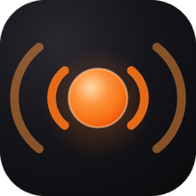
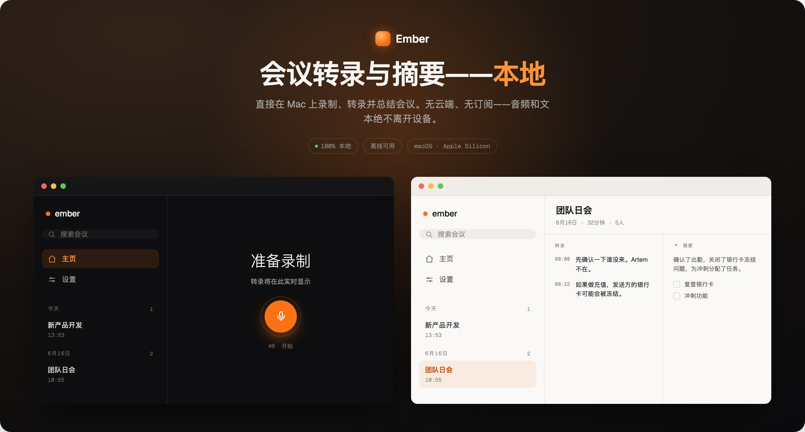
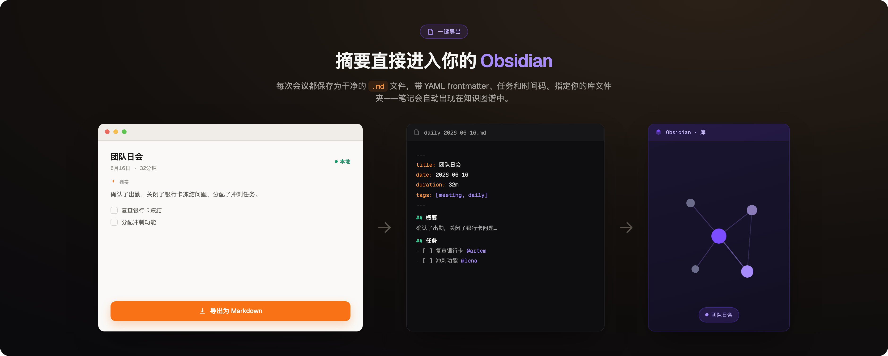

<div align="center">

<a href="README.md">English</a> · <a href="README.ru.md">Русский</a> · <b>简体中文</b>



# Ember

**macOS 上的本地会议录制、转写与摘要工具。**

录制你的麦克风和对方的声音，实时生成转写，并产出简短摘要 —— 全部在你的 Mac 上完成，
不上传任何内容。




</div>

---

## 这是什么

Ember 录制会议（麦克风 + 系统音频），用 Whisper 在本机转写，再由本地语言模型生成
结构化摘要 —— 概述、决定、行动项。完全离线，无需账号，不依赖云端。

## 功能

- **实时转写**，并标注来源：`[mic]`（你）与 `[mac]`（对方）。
- **自动通话检测** —— 通话开始即录制，结束即停止，窗口最小化时也有效。
- **本地摘要**，基于 Apple MLX（Qwen3），使用转写所用语言。
- **跨会议搜索**、重命名，以及 Markdown / Obsidian 导出。
- **菜单栏控制** 与 **⌘R** 开始/停止。
- 浅色 / 深色 / 自动主题；中文、英文、俄文。
- 通过 GitHub Releases 内置更新。

## 导出到 Obsidian

每份摘要都可写入你选定文件夹中的 Markdown 文件（YAML 前置信息、任务、时间戳）——
例如 Obsidian 仓库。

<div align="center"></div>

## 安装

需要 **Apple Silicon** 上的 **macOS 14.4+**。

1. 从 [Releases](../../releases/latest) 页面下载 `Ember_1.5.1_aarch64.dmg`。
2. 将 **Ember.app** 拖入 **应用程序**。
3. 应用为 ad-hoc 签名（未经过 Apple 公证），首次启动会被拦截。可右键 **Ember.app →
   打开 → 打开**，或在终端运行：
   ```bash
   xattr -dr com.apple.quarantine /Applications/Ember.app
   ```
4. 首次启动时选择语言，然后下载 Whisper 模型和摘要模型。

## 从源码构建

需要较新的 Xcode 和 [Tuist](https://tuist.dev)。

```bash
cd native
tuist install
tuist generate
open Ember.xcworkspace          # 或：xcodebuild -scheme Ember -configuration Release build
```

模型在首次运行时从 Hugging Face 下载。仅使用 ad-hoc 签名 —— 无需 Apple Developer 账号。

## 隐私

- 录制、转写和摘要均在本地完成。
- 音频写入临时文件夹，转写后立即删除；只保留文本（转写 + 摘要），存于 Mac 上的本地
  SQLite 数据库。
- 唯一的联网是下载模型（Hugging Face）和检查更新（GitHub）。无遥测、无账号。

## 技术栈

SwiftUI · WhisperKit（CoreML/ANE）· Apple MLX（Qwen3）· GRDB（SQLite）· CoreAudio。
